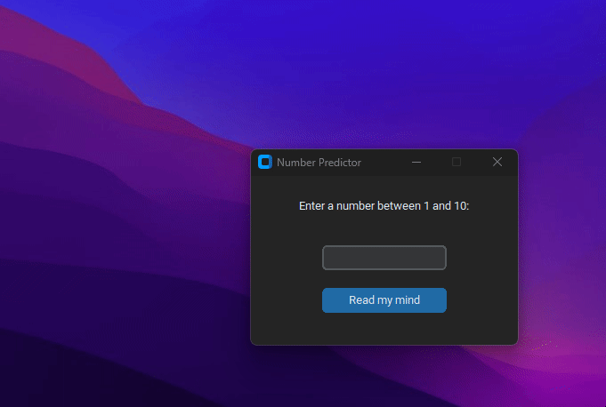
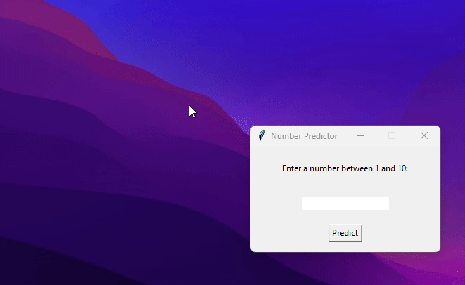

# Number Predictor

## Introduction
This project employs advanced machine learning techniques, including regression models and neural networks, to analyze brain signals captured by a specialized device. By utilizing these sophisticated models, it deciphers intricate patterns within the data, enabling precise predictions. Furthermore, it feeds these brainwave patterns into neural networks to accurately predict the number with 99.929% accuracy!

**~~I came across this [post](https://www.instagram.com/reel/Cw60gVarAaI/?utm_source=ig_web_copy_link&igshid=MzRlODBiNWFlZA==) on instagram and thought it would be fun to give it a shot~~**

## Versions

So, the normal version resembles the one seen in the Instagram post, while the modern version utilizes custom Tkinter elements and boasts a more aesthetically pleasing design

| **Modern Version** | **Normal Version** |
|:---:|:---:|
|  |  |
| [View Code](modern.py) | [View Code](normal.py) |

## How to Use

1. download/clone the script you prefer.
2. install the requirements using `pip install -r requirements.txt`.
3. run the script using `python modern.py` or `python normal.py`.

## License

This project is open-source and available under the [MIT License](LICENSE). Feel free to use, modify, and share it.
